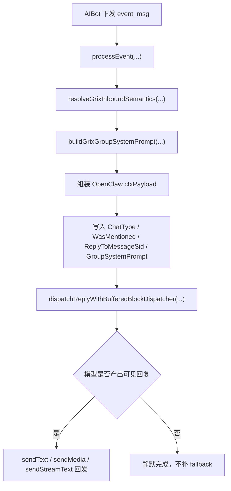
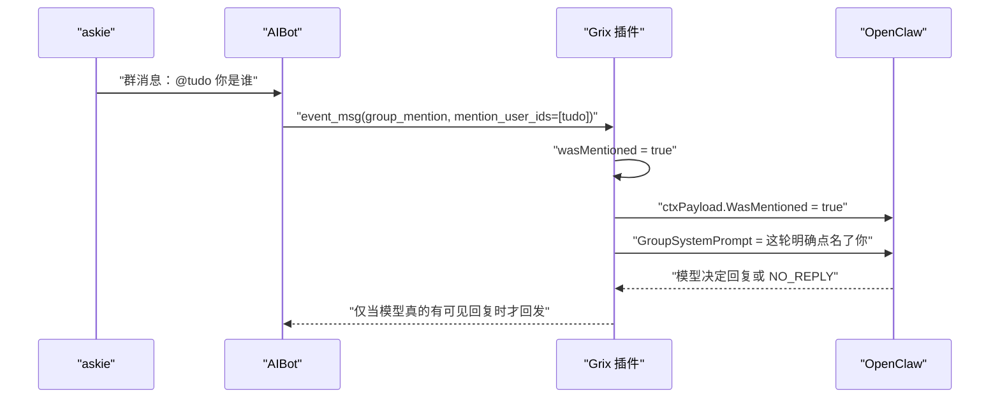
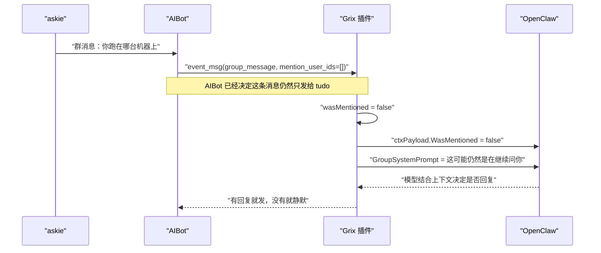
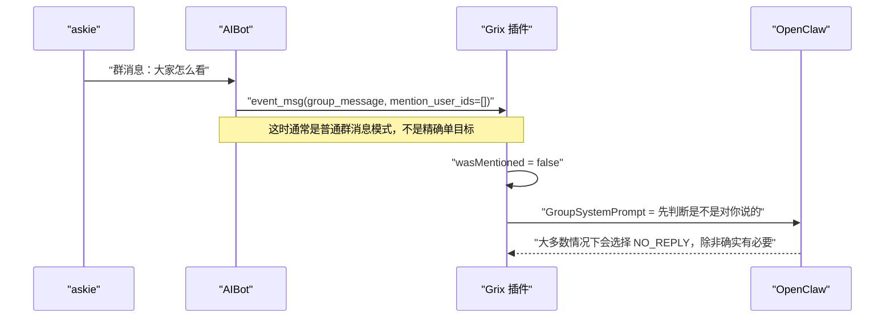
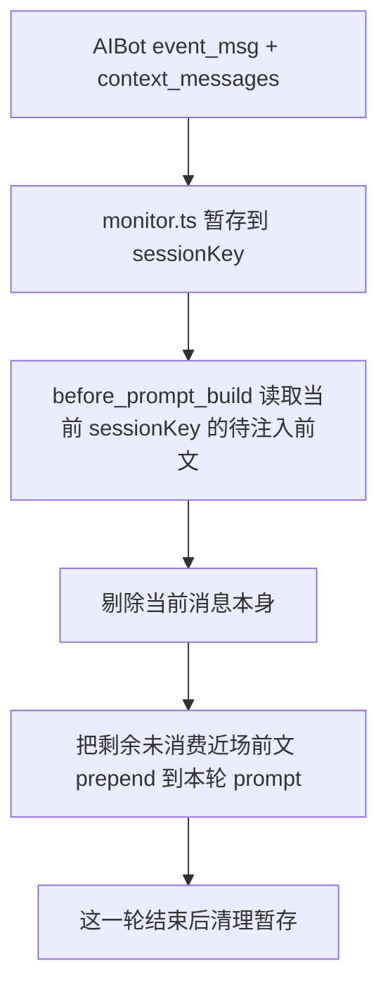

# Grix 群消息分发与 OpenClaw 接收说明（插件侧）

> 更新时间：2026-04-06  
> 状态：已落地  
> 适用范围：`src/monitor.ts`、`src/group-adapter.ts`、`src/group-semantics.ts`

本文档说明 Grix OpenClaw 插件在群聊里“收到什么、怎么理解、怎么交给模型判断”。

对应 AIBot 后端说明见：

- `grix/backend/docs/backend/websocket/18_group_message_dispatch_mechanism.md`

---

## 1. 先说结论

插件现在不是“群里所有消息都自己再筛一遍”，而是采用下面这条分工：

1. AIBot 后端负责决定这条消息到底发给谁
2. 插件负责把收到的事件准确翻译成 OpenClaw 上下文
3. 模型自己决定要不要回复

所以插件当前要处理的重点不是“再做一次路由”，而是：

1. 区分这条消息是不是明确 `@` 了当前 agent
2. 区分这条消息是不是普通群上下文
3. 识别“虽然没 `@`，但可能仍然是在继续问你”的情况

---

## 2. 插件侧职责边界

### 2.1 插件负责的事

1. 解析 AIBot 下发的 `event_type`
2. 解析 `mention_user_ids`
3. 生成给 OpenClaw 的群聊系统提示
4. 把 `WasMentioned`、`ReplyToMessageSid`、`GroupSystemPrompt` 等字段送进 OpenClaw
5. 在模型决定静默时安静结束，不再补兜底话术

### 2.2 插件不再负责的事

1. 不再决定“这条群消息该发给哪个 agent”
2. 不再把连续追问伪装成新的 mention
3. 不再硬塞固定回复

---

## 3. 插件主流程

---

## 4. AIBot 事件如何映射到插件语义

### 4.1 输入字段

插件主要看这些字段：

| 字段 | 来源 | 插件用途 |
|---|---|---|
| `event_type` | AIBot | 判断是 `group_message` 还是 `group_mention` |
| `mention_user_ids` | AIBot | 保留原始点名目标信息 |
| `quoted_message_id` | AIBot | 映射为回复链路上下文 |
| `session_id` / `session_type` | AIBot | 标识当前会话 |

### 4.2 插件内部语义

插件把消息先归纳成这几个布尔状态：

| 字段 | 含义 |
|---|---|
| `wasMentioned` | 当前 agent 是否被明确点名 |
| `hasAnyMention` | 这条消息是否带 mention 目标 |
| `mentionsOther` | 这条消息是否点名了别人而不是我 |

当前实现规则：

1. `event_type = group_mention` 时，`wasMentioned = true`
2. `event_type = group_message` 时，`wasMentioned = false`
3. `mention_user_ids` 非空但 `wasMentioned = false` 时，认为“点名的是别人”

补充说明：

1. 在 AIBot 现在的精确分发机制下，当前 agent 通常不会再收到“明确只点名别人”的消息
2. 但插件仍保留这层判断，作为协议完整性保护

---

## 5. `WasMentioned` 和“连续追问”不是一回事

这是插件侧最容易踩错的地方。

现在要这样理解：

| 场景 | `WasMentioned` | 真正含义 |
|---|---|---|
| 用户显式 `@你` | `true` | 这次明确点名你 |
| 用户没有再 `@你`，但后端把它继续路由给你 | `false` | 这次没点名，但大概率还在继续问你 |
| 完全普通群消息 | `false` | 只是上下文，是否回复要更谨慎 |

所以：

1. `WasMentioned=false` 不等于“肯定不是在对你说”
2. 它只表示“这次没有新的明确点名”

这也是为什么插件的提示文案已经改成：

1. 如果 `WasMentioned=true`，说明你是明确主对象
2. 如果 `WasMentioned=false`，先根据最近上下文判断这是不是仍然在继续对你说

---

## 6. 为什么插件还保持 `requireMention=false`

插件这里仍然没有启用 OpenClaw 默认那套“没 mention 就不进入回复”的硬门槛。

原因很直接：

1. 群里连续两句自然追问时，人类通常不会每句都再 `@` 一次
2. 现在 AIBot 已经把这类消息精确路由给真正对象了
3. 如果插件这里再额外加一道“必须 `WasMentioned=true` 才能进入”的门槛，连续对话还是会断

所以插件当前策略是：

1. 不做第二层强拦截
2. 让模型看到这条消息
3. 用系统提示把“这可能是继续问你，也可能只是上下文”说清楚
4. 由模型决定回复还是 `NO_REPLY`

---

## 7. 群聊系统提示现在怎么工作

### 7.1 明确点名你

当 `WasMentioned=true` 时，插件会告诉模型：

1. 这轮明确点名了你
2. 你是主对象
3. 但回复与否仍由你自己决定

### 7.2 没点名你，但可能仍然在继续问你

当 `WasMentioned=false` 时，插件现在不再直接把它描述成“只是路过背景”。

而是告诉模型：

1. 这轮不是明确 mention
2. 它可能只是群上下文
3. 也可能是后端已经判定仍然在继续对你说
4. 需要结合最近上下文判断

### 7.3 没点名且明显是别人的事

如果消息确实明显只指向别人，模型应该优先静默。

---

## 8. 例子一：显式 `@` 当前对象

用户发：

`@tudo 你是谁`

这里的重点是：

1. 插件会把它当成明确点名
2. 但不会强迫模型必须回

---

## 9. 例子二：没有 `@`，但仍然在继续问刚才那个对象

上一句刚刚是：

`@tudo 你是谁`

下一句是：

`你跑在哪台机器上`

这里最关键的是：

1. 插件不会把这条消息误写成新的 mention
2. 但也不会把它误判成单纯的背景噪音

---

## 10. 例子三：没有 `@`，也没有连续目标

用户发：

`大家怎么看`

---

## 11. 插件对 OpenClaw 的实际输入

插件当前会把这些关键信息交给 OpenClaw：

| 上下文字段 | 含义 |
|---|---|
| `ChatType=group` | 这是群聊 |
| `WasMentioned` | 这次是不是明确点名了当前 agent |
| `ReplyToMessageSid` | 当前消息引用了哪条消息 |
| `GroupSystemPrompt` | 插件针对群聊生成的策略提示 |

可以把它理解成：

1. AIBot 决定“这条消息给谁看”
2. 插件决定“把这条消息用什么语义告诉模型”

---

## 12. 插件侧当前实现落点

### 12.1 群聊接入配置

- `src/group-adapter.ts`

职责：

1. 声明 Grix 群聊不是硬 mention-gated
2. 给模型一段总提示，解释它收到的是“可能需要你注意的群消息”

### 12.2 群聊语义解析

- `src/group-semantics.ts`

职责：

1. 解析 `event_type`
2. 计算 `wasMentioned`
3. 构造不同场景下的 `GroupSystemPrompt`
4. 决定无输出时是否安静完成

### 12.3 入站事件组装

- `src/monitor.ts`

职责：

1. 接收 AIBot `event_msg`
2. 组装 OpenClaw `ctxPayload`
3. 调用 OpenClaw 回复分发入口

---

## 13. 当前策略的边界

插件当前明确不做这些事：

1. 不自己重新推断“被引用消息的主人是不是该算 mention”
2. 不把没有 `@` 的连续消息改写成 `WasMentioned=true`
3. 不在模型静默时补一句固定回复

所以如果后面看到：

1. `group_mention`
   - 说明这次真的是明确点名
2. `group_message`
   - 说明要么是普通群消息，要么是后端沿用目标后的连续追问

插件只能按这个语义继续往下处理，不能擅自改写。

---

## 14. 增量前文怎样进入当前轮

插件现在除了收到当前这条 `event_msg`，还会接到后端附带的 `context_messages`。

这一批 `context_messages` 的含义不是“固定最近 N 条”，而是：

1. 这是后端替当前对象积攒下来、还没消费过的近场可见前文
2. 里面会带上当前消息本身，插件在送给 OpenClaw 时会把当前消息剔掉，避免重复
3. 同一批一旦进入这一轮 prompt，后端那边就会清掉，不会下次再重复塞一遍

插件侧的处理顺序是：

这样做的好处是：

1. 模型能像人一样先看到刚刚发生、但自己还没真正处理过的几句
2. 又不会因为固定回捞窗口，把同一段前文一遍遍重复塞进去

---

## 15. 模型按需补查历史

插件除了把当前这轮消息交给模型，也会把 AIBot 已有的历史查询能力暴露成工具：

| 工具 | action | 用途 |
|---|---|---|
| `grix_query` | `message_history` | 往前翻当前会话的原始消息 |
| `grix_query` | `message_search` | 用关键词搜索当前会话历史 |

这意味着插件侧现在采用的是“两段式上下文”：

1. 当前回合先给模型一段必要的近场上下文
2. 如果模型判断还不够，再自己决定要不要调用 `grix_query`

这样比“每次都塞很多历史”更接近人类：

1. 先看眼前这几句
2. 真有必要再回看
3. 想找某个主题时直接搜关键词

插件里的群聊提示文案也已经同步成这套真实能力，不再提不存在的历史工具名。

---

## 16. 一句话总结

插件侧现在做的是：

1. 相信 AIBot 的路由结果
2. 保留“明确点名”和“连续追问”之间的语义差别
3. 把判断权交给模型
4. 不再用兜底话术替模型做决定
5. 把后端送来的“未消费近场前文”只注入这一轮，避免重复
6. 需要更多上下文时，引导模型用 `grix_query` 自主翻历史或搜历史
