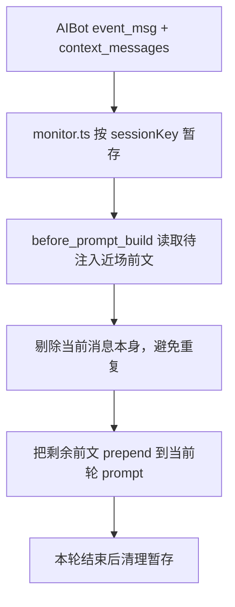

# Grix 群消息分发与 OpenClaw 接收说明（插件侧）

> 更新时间：2026-04-08
> 状态：已落地  
> 适用范围：`src/channel.ts`、`src/group-adapter.ts`、`src/group-tool-policy.ts`、`src/group-semantics.ts`、`src/inbound-context.ts`、`src/monitor.ts`

本文档只说明插件侧现在真实做了什么，不讨论后端理想设计。

---

## 1. 先说结论

插件现在对群聊的处理分成三层：

1. AIBot 后端先决定这条群消息要不要发给当前 agent
2. 插件把这条消息翻译成 OpenClaw 能理解的群聊上下文
3. 模型自己决定回复还是 `NO_REPLY`

插件当前不会做这些事：

1. 不重新路由群消息
2. 不把“连续追问”强行改写成新的 mention
3. 不在模型静默时补固定兜底回复

插件当前会保留三类群聊信息：

1. 静态群聊规则：`requireMention=false`、群聊总提示、群聊工具限制
2. 每条消息的事实语义：是不是群聊、是不是明确点名了你、是不是点名了别人
3. 一次性近场前文：`context_messages`

---

## 2. 模块怎么分工

| 模块 | 当前职责 |
|---|---|
| `src/group-adapter.ts` | 提供群聊总提示，告诉模型“这条群消息已经过后端筛选”“可结合 `WasMentioned` 和近场上下文决定要不要回复” |
| `src/group-tool-policy.ts` | 在群聊里默认禁用主动 `message` 工具 fanout |
| `src/group-semantics.ts` | 解析群聊事实字段，生成每条消息的事实型 `GroupSystemPrompt` |
| `src/inbound-context.ts` | 暂存 `context_messages`，并在当前轮 prompt 构建前做一次性注入 |
| `src/monitor.ts` | 接收 `event_msg`，组装 OpenClaw `ctxPayload`，调用回复分发 |
| `src/channel.ts` | 把上面这些群聊规则挂到 OpenClaw Channel 的 `groups` 能力上 |

---

## 3. Channel 层的群聊规则

`src/channel.ts` 里这三个群聊 hook 会一起生效：

| Hook | 落点 | 当前行为 |
|---|---|---|
| `groups.resolveRequireMention()` | `src/group-adapter.ts` | 返回 `false`，不做“必须 mention 才能进模型”的硬拦截 |
| `groups.resolveGroupIntroHint()` | `src/group-adapter.ts` | 提供一段静态总提示：消息已被筛选、可结合 `WasMentioned` 与上下文判断、必要时可用 `grix_query` 查历史、明显不该你回时用 `NO_REPLY` |
| `groups.resolveToolPolicy()` | `src/group-tool-policy.ts` | 默认禁用 `message` 工具，避免群聊里主动 fanout |

这里要区分两种提示：

1. `resolveGroupIntroHint()` 是 channel 级别的静态总提示
2. `GroupSystemPrompt` 是每条消息动态生成的事实型提示

前者还带一些策略性语言，后者现在已经尽量收缩成事实描述。

---

## 4. 每条群消息是怎么被翻译的

### 4.1 插件主要看哪些入站字段

| 字段 | 来源 | 用途 |
|---|---|---|
| `session_type` | AIBot | 判断是不是群聊 |
| `event_type` | AIBot | 区分 `group_mention` 与其他群事件 |
| `mention_user_ids` | AIBot | 判断有没有点名，以及是不是点名了别人 |
| `quoted_message_id` | AIBot | 进入回复链路上下文 |
| `context_messages` | AIBot | 当前轮一次性近场前文 |

### 4.2 插件内部会计算哪些语义

`src/group-semantics.ts` 会先算出这些事实：

| 字段 | 含义 |
|---|---|
| `isGroup` | 当前是不是群聊 |
| `wasMentioned` | 当前 agent 这次是不是被明确点名 |
| `hasAnyMention` | 这条消息有没有 mention 任何人 |
| `mentionsOther` | 有 mention，但不是点名当前 agent |
| `mentionUserIds` | 去重后的 mention 目标列表 |

当前规则很直接：

1. `session_type=2` 或 `event_type` 以 `group_` 开头时，认为是群聊
2. `event_type=group_mention` 时，`wasMentioned=true`
3. 群聊里如果有 `mention_user_ids` 且 `wasMentioned=false`，则 `mentionsOther=true`

### 4.3 每条消息的 `GroupSystemPrompt` 现在只保留事实

`buildGrixGroupSystemPrompt(...)` 生成的动态提示现在不再负责复杂策略，只会给模型这些事实：

1. 这是群聊回合
2. 这次是明确点名你，还是点名了别人，还是没有明确点名
3. 如果有 mention，就把提到的用户 id 带出来

可以把它理解成下面三种文本风格：

| 场景 | 动态提示的语气 |
|---|---|
| 明确点名你 | `Group turn. Explicit mention of you.` |
| 点名了别人 | `Group turn. Mention of someone else, not you.` |
| 没有明确点名 | `Group turn. No explicit mention of you.` |

也就是说：

1. “是不是继续在问你”这类判断，不再由动态 `GroupSystemPrompt` 明说
2. 这部分更多留给静态群聊总提示 + 近场上下文 + 模型自己判断

---

## 5. 插件交给 OpenClaw 的群聊输入

`src/monitor.ts` 在组装 `ctxPayload` 时，群聊相关字段主要是这些：

| 上下文字段 | 当前含义 |
|---|---|
| `ChatType=group` | 当前是群聊 |
| `WasMentioned` | 这次是不是明确点名了当前 agent |
| `ReplyToMessageSid` | 当前消息引用了哪条消息 |
| `GroupSystemPrompt` | 当前这条消息的事实型群聊提示 |
| `BodyForCommands=""` | 明确禁止把普通群聊文本当成 OpenClaw 原生命令解析 |

所以插件现在做的是：

1. 给 OpenClaw 足够的事实
2. 但不替模型把结论下死

---

## 6. `WasMentioned` 在当前实现里到底表示什么

现在要把 `WasMentioned` 理解得更窄一些：

| 场景 | `WasMentioned` | 含义 |
|---|---|---|
| 用户明确 `@你` 或后端把事件标成 `group_mention` | `true` | 这次明确指向你 |
| 用户没 `@你`，但消息仍被后端发给你 | `false` | 这次没有新的明确点名，是否仍在问你要靠上下文判断 |
| 用户点名了别人 | `false` | 当前事件不是明确指向你 |

所以：

1. `WasMentioned=false` 不等于“肯定不是在对你说”
2. 但插件也不会自作主张把它改成 `true`

---

## 7. 近场前文怎么进入当前轮

AIBot 现在还会把 `context_messages` 一起带进来。插件侧处理顺序是：



这批近场前文有几个特点：

1. 是一次性的，不会反复重放
2. 当前消息本身会被剔掉，避免在 prompt 里重复出现
3. 它不是完整历史，只是“这轮前面值得顺手看一眼的近场上下文”

如果还不够，插件当前会在群聊总提示里引导模型按需调用：

1. `grix_query` + `message_history`
2. `grix_query` + `message_search`

---

## 8. 群聊里哪些事插件明确不做

当前实现里，插件明确不做这些推断：

1. 不根据“被引用消息的作者”反推这次是不是应该算 mention
2. 不把连续追问改写成 `WasMentioned=true`
3. 不自己判断“这句一定该你回”

插件现在保留的是“事实 + 一次性近场前文 + 通用群聊提示”，而不是“替模型做群聊策略决策”。

---

## 9. 静默完成现在是什么规则

这是当前代码里很容易误解的点。

`resolveGrixDispatchResolution(...)` 的现状是：

1. 只要已经有可见输出，当然正常结束
2. 如果没有可见输出，但这是群聊，也允许安静结束

这条规则对普通群消息和明确点名都一样。

也就是说：

1. 即使 `WasMentioned=true`
2. 如果模型最终选择 `NO_REPLY` 或没有产出可见消息
3. 插件也不会再补一句固定话术

当前测试里已经覆盖了这一点：

1. 普通群消息静默完成是允许的
2. 明确点名但静默完成也是允许的

---

## 10. 两个最典型的例子

### 10.1 明确点名当前 agent

输入大致像这样：

```json
{
  "session_type": 2,
  "event_type": "group_mention",
  "mention_user_ids": ["42", "99"]
}
```

插件会给出：

1. `WasMentioned=true`
2. `GroupSystemPrompt` 类似 `Group turn. Explicit mention of you. Mentioned users: 42, 99.`

### 10.2 群里点名了别人

输入大致像这样：

```json
{
  "session_type": 2,
  "event_type": "group_message",
  "mention_user_ids": ["other-agent"]
}
```

插件会给出：

1. `WasMentioned=false`
2. `mentionsOther=true`
3. `GroupSystemPrompt` 类似 `Group turn. Mention of someone else, not you. Mentioned users: other-agent.`

这时候插件不会直接替模型下结论，只是把事实带进去。

---

## 11. 插件侧还保留了哪些保护

除了群聊语义本身，插件还保留两层运行保护：

1. 入站事件先做去重和待处理落盘，避免处理中途掉线直接丢失
2. 连接恢复后，会尝试补做已接收但未走到终态的事件

这两层都在 `src/monitor.ts` 和 `inbound-event-*` 相关模块里。

---

## 12. 一句话总结

插件侧现在对群聊做的是：

1. 保留群聊可见性，不加硬 mention 门槛
2. 通过静态群聊总提示告诉模型怎么判断
3. 通过动态 `GroupSystemPrompt` 只提供事实，不替模型下结论
4. 通过 `context_messages` 提供一次性近场前文
5. 通过工具策略禁止群聊里主动 `message` fanout
6. 在模型静默时安静结束，不补兜底回复
