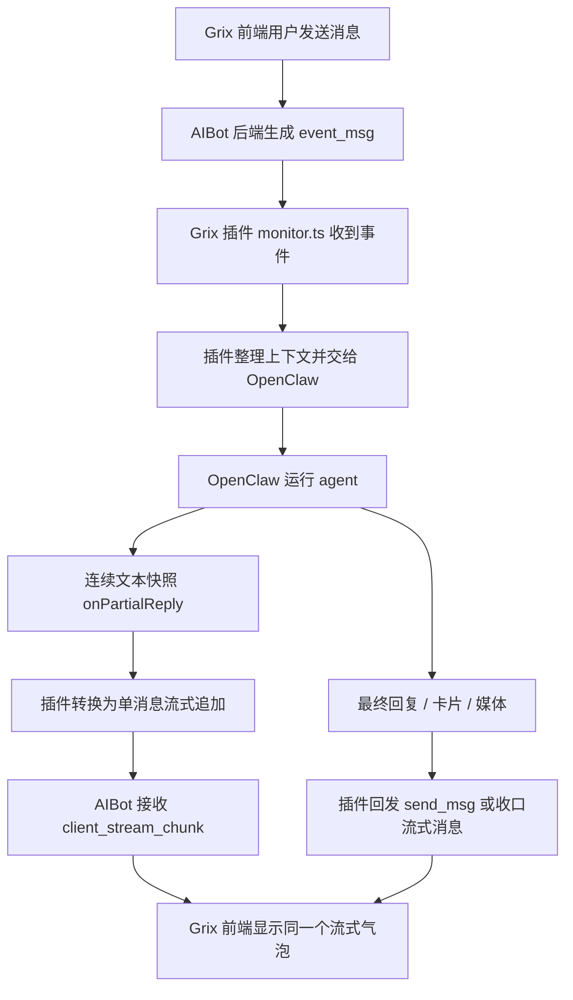
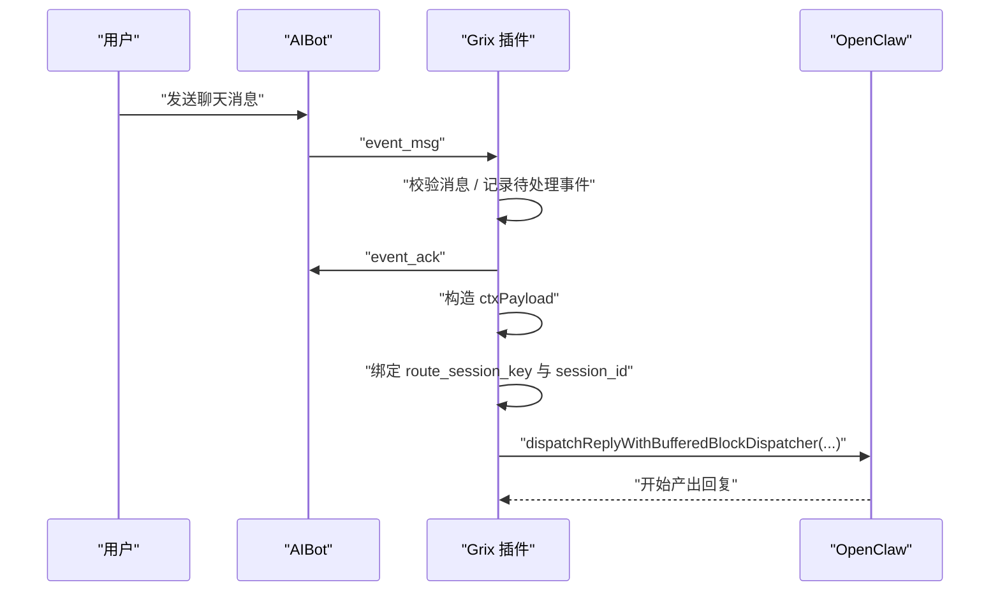
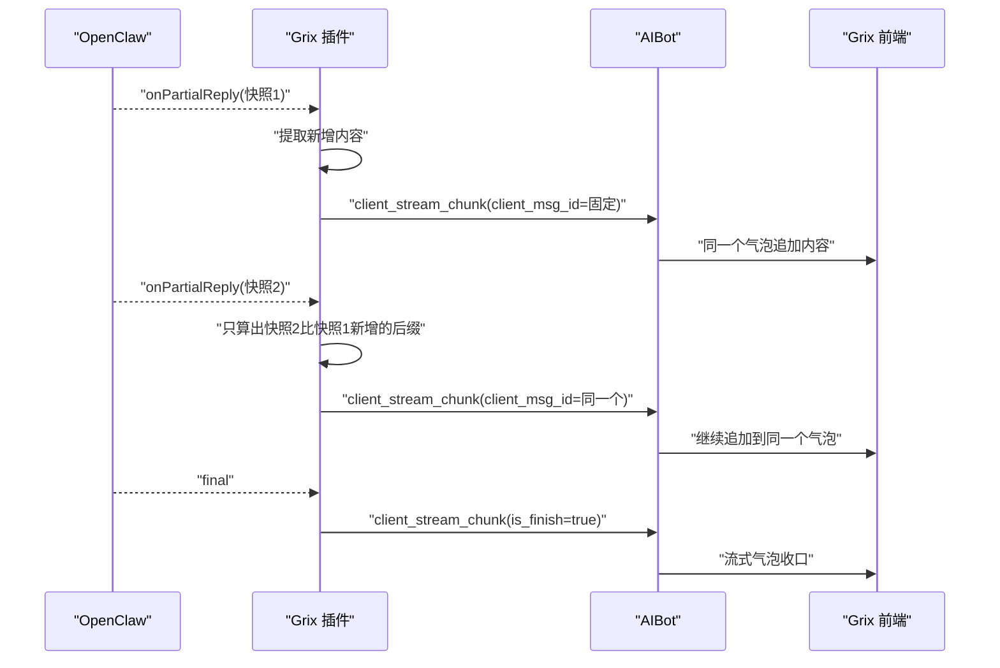
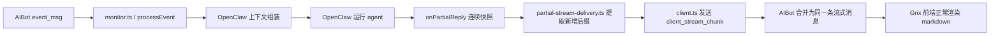

# Grix 插件与 AIBot / OpenClaw 对接流程说明

> 更新时间：2026-04-07  
> 状态：已落地  
> 适用范围：`src/monitor.ts`、`src/client.ts`、`src/partial-stream-delivery.ts`、`src/aibot-payload-delivery.ts`

本文档说明 Grix 插件在 AIBot 和 OpenClaw 之间到底做了什么，以及消息是怎么进、怎么出、为什么现在既能保留流式效果，又不会把 LaTeX、Mermaid 这类 markdown 内容切坏。

---

## 1. 先说结论

Grix 插件当前扮演的是一个中间翻译层：

1. AIBot 负责把聊天事件通过 WebSocket 发给插件，也负责最终把消息展示到前端页面
2. OpenClaw 负责理解上下文、调用工具、生成回复
3. Grix 插件负责把 AIBot 事件翻译成 OpenClaw 能理解的上下文，再把 OpenClaw 的回复翻译回 AIBot 协议

现在已经验证通过的正确链路是：

1. 入站时，插件接收 AIBot 的 `event_msg`
2. 插件把这条消息整理成 OpenClaw 的上下文，然后交给 OpenClaw
3. OpenClaw 回复时，插件不用会切坏 markdown 的 `block` 分段流
4. 插件改用 OpenClaw 的连续文本快照流
5. 插件把连续文本快照转换成同一个消息气泡的追加流
6. AIBot 前端最终看到的是一个持续刷新的消息气泡，LaTeX、Mermaid、代码块都能正常渲染

---

## 2. 三方职责边界

### 2.1 AIBot 负责什么

1. 管理会话和消息事件
2. 通过 WebSocket 给插件发 `event_msg`、`event_stop`、`event_revoke`
3. 接收插件回发的 `event_ack`、`event_result`、`client_stream_chunk`、`send_msg`
4. 把流式消息和最终消息展示到 Grix 前端

### 2.2 Grix 插件负责什么

1. 维护和 AIBot 的 WebSocket 连接
2. 把入站消息转成 OpenClaw 上下文
3. 负责会话路由绑定、引用消息处理、群聊语义补充
4. 把 OpenClaw 的回复转换成 AIBot 协议
5. 把连续回复整理成一个稳定的流式气泡

### 2.3 OpenClaw 负责什么

1. 根据上下文运行 agent
2. 产出中间回复、工具结果、最终回复
3. 在需要时提供连续文本快照流

---

## 3. 总体流程图

---

## 4. 入站流程：AIBot 怎么把消息交给 OpenClaw

### 4.1 AIBot 发给插件的核心事件

插件主要接收这些入站事件：

| 事件 | 用途 |
|---|---|
| `event_msg` | 用户发来一条新消息 |
| `event_stop` | 用户要求停止当前回复 |
| `event_revoke` | 用户撤回消息 |

其中最核心的是 `event_msg`，里面会带上：

| 字段 | 作用 |
|---|---|
| `session_id` | 当前会话 ID |
| `msg_id` | 当前消息 ID |
| `event_id` | 当前事件 ID |
| `content` | 用户实际发的文本 |
| `quoted_message_id` | 引用的消息 ID |
| `context_messages` | AIBot 附带的上下文消息 |

### 4.2 插件接到消息后的处理顺序

插件收到 `event_msg` 以后，主流程在 `src/monitor.ts` 的 `processEvent(...)` 里。

处理顺序是：

1. 校验 `session_id`、`msg_id`、`content`
2. 持久化待处理事件，避免进程中断时丢消息
3. 先向 AIBot 回 `event_ack`
4. 根据当前会话生成 OpenClaw 所需的上下文
5. 绑定 `route_session_key -> session_id`
6. 调用 OpenClaw 的回复分发器

### 4.3 入站时序图

---

## 5. 出站流程：OpenClaw 的回复怎么回到 AIBot

### 5.1 正常文本、媒体、卡片回复

如果是普通最终消息、媒体消息、结构化卡片，插件走的是普通出站链路：

1. 先把 OpenClaw 回复转换成 AIBot 可识别的文本或卡片数据
2. 普通文本和卡片走 `send_msg`
3. 媒体走 `sendMedia`
4. 工具执行卡片、审批卡片这类结构化内容也走普通消息发送

这部分主要在：

1. `src/aibot-payload-delivery.ts`
2. `src/outbound-envelope.ts`
3. `src/client.ts`

### 5.2 流式文本回复

如果是正在持续生成的文本回复，当前实现不再把 OpenClaw 的 `block` 分段直接发给 AIBot。

现在用的是：

1. `replyOptions.disableBlockStreaming = true`
2. `replyOptions.onPartialReply = ...`

这一步非常关键。

它的含义不是“关闭流式效果”，而是：

1. 关闭那种会把 markdown 拆成独立块的流式方式
2. 改成拿 OpenClaw 的连续文本快照
3. 继续保留流式展示

---

## 6. 为什么之前的 block 流式会把 markdown 搞坏

之前的问题不是“前端不会渲染 markdown”，而是上游送出来的流式内容类型用错了。

OpenClaw 的 `block` 分段更像是：

1. 一段一段“适合独立显示”的内容块
2. 不是可以机械拼接的原始字符增量

这类 `block` 在代码块、LaTeX、Mermaid 场景里，可能会发生：

1. 当前块临时把围栏收口
2. 下一块再重新开头
3. 为了安全分块，文本边界并不是简单字符续写

所以如果插件把多个 `block`：

1. 硬拼到同一个流式消息里，会破坏 markdown 结构
2. 每个 `block` 单独发成一个气泡，页面又会碎成很多段

这两种都不对。

---

## 7. 现在正确的流式方案

### 7.1 核心思路

当前方案是：

1. 不再使用 OpenClaw 的 `block` 流
2. 改用 `onPartialReply` 提供的连续文本快照
3. 插件自己比较“上一次快照”和“这一次快照”
4. 只把新增的那一小段增量发给 AIBot
5. 始终使用同一个 `client_msg_id`
6. AIBot 前端就会把它当成同一个流式气泡持续追加

### 7.2 这一步在哪个文件里实现

核心逻辑在：

1. `src/monitor.ts`
2. `src/partial-stream-delivery.ts`

其中：

1. `createAppendOnlyReplyStream(...)` 负责维护同一个流式消息
2. `applyAppendOnlyStreamUpdate(...)` 负责从连续快照里提取新增后缀
3. `client.sendStreamChunk(...)` 负责把增量通过 `client_stream_chunk` 发回 AIBot

### 7.3 流式时序图

---

## 8. 为什么现在 LaTeX、Mermaid 能正常显示

因为前端现在拿到的是：

1. 同一个消息气泡里的连续追加文本
2. 最终能组成一份完整 markdown

而不是：

1. 多个彼此独立的小块消息
2. 或者已经被错误切开的 `block` 拼接内容

所以像下面这些内容现在都能正常工作：

1. LaTeX 公式块
2. Mermaid 代码块
3. 普通 fenced code block
4. 多段 markdown 混合内容

---

## 9. 包级别协议怎么走

### 9.1 AIBot -> 插件

| 包名 | 说明 |
|---|---|
| `event_msg` | 新消息到达 |
| `event_stop` | 停止当前回复 |
| `event_revoke` | 撤回消息 |

### 9.2 插件 -> AIBot

| 包名 | 说明 |
|---|---|
| `event_ack` | 已收到该事件 |
| `event_result` | 该事件最终处理结果 |
| `client_stream_chunk` | 同一条消息的流式增量 |
| `send_msg` | 普通最终消息 |
| `delete_msg` | 删除消息 |
| `session_activity_set` | 输入中 / composing 状态 |
| `event_stop_ack` | 已接受停止请求 |
| `event_stop_result` | 停止动作最终结果 |

---

## 10. 一个完整的真实链路

可以把当前实现简单理解成下面这条链：

---

## 11. 当前最终结论

当前这套实现已经明确验证：

1. 流式效果还在
2. 前端看到的是同一个持续刷新的气泡
3. LaTeX、Mermaid、代码块不会再被拆坏
4. `disableBlockStreaming = true` 关闭的是错误的块流，不是关闭流式本身

如果后面继续排查这条链路，优先看这几个文件：

1. `src/monitor.ts`
2. `src/partial-stream-delivery.ts`
3. `src/client.ts`
4. `src/aibot-payload-delivery.ts`
