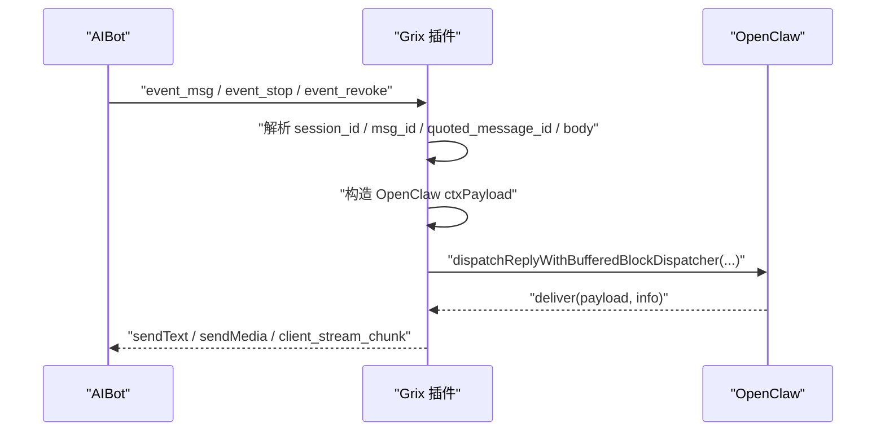
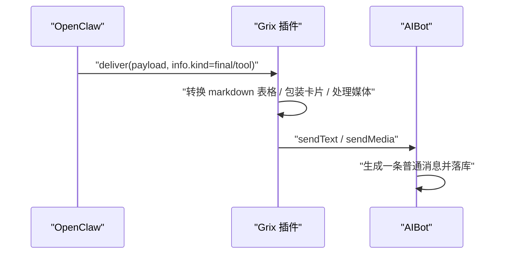
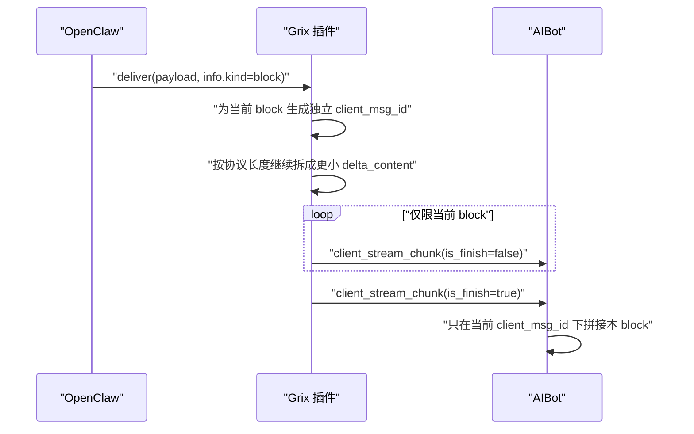
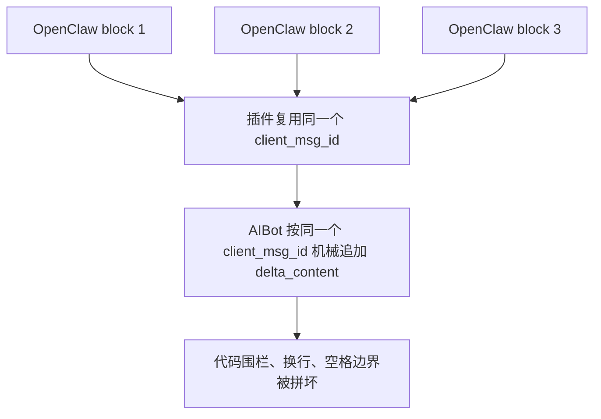
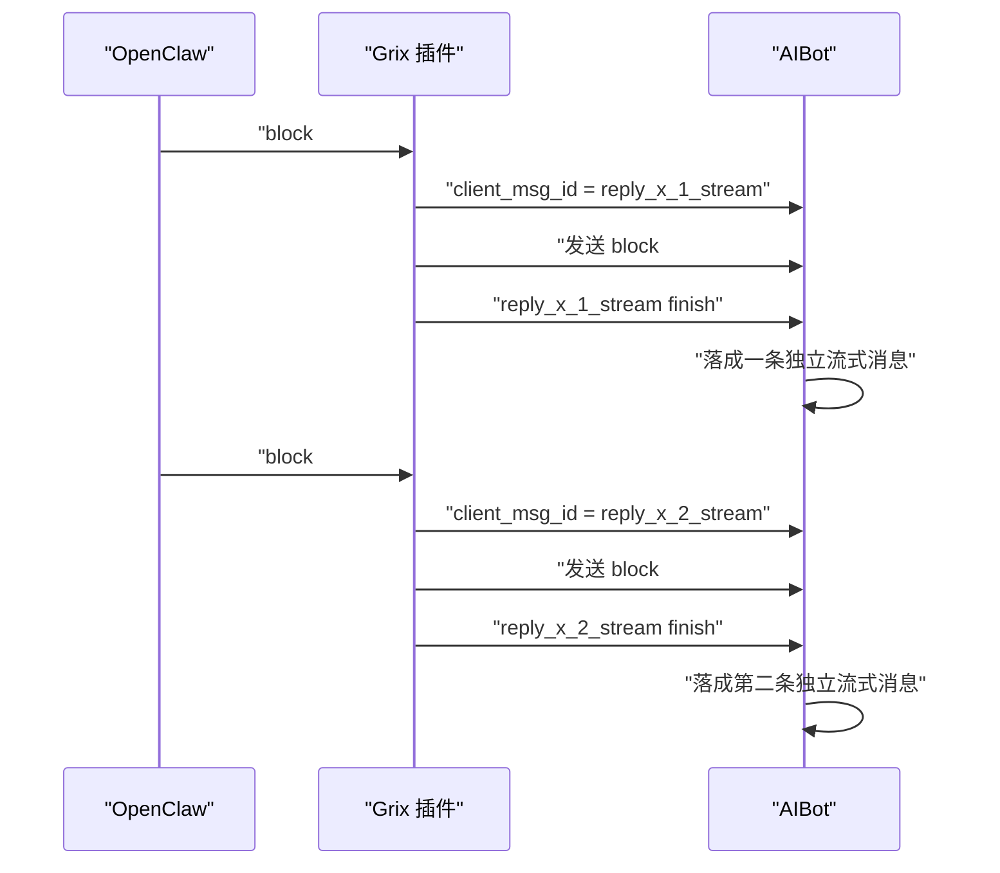

# Grix 插件、OpenClaw 与 AIBot 对接传输说明

> 更新时间：2026-04-07  
> 状态：已落地  
> 适用范围：`src/monitor.ts`、`src/client.ts`、`src/stream-block-delivery.ts`、`src/protocol-text.ts`

本文档专门说明一件事：

1. AIBot 把什么发给 Grix 插件
2. Grix 插件怎么把它翻译给 OpenClaw
3. OpenClaw 产出的回复，插件又是怎么回给 AIBot
4. `block` 分段为什么不能直接当成一条消息里的连续增量硬拼

---

## 1. 先说结论

这条链路里有三个角色：

1. AIBot 负责会话连接、事件下发、消息存储和流式拼接
2. Grix 插件负责协议转换、上下文组装和回发策略
3. OpenClaw 负责生成回复内容，并把回复按 `block`、`final`、`tool` 这些语义类型交给插件

当前正确的发送原则是：

1. `final` 和 `tool` 按普通消息发送
2. `block` 按“一个 block 一条独立流式消息”发送
3. 一个 `block` 内部如果太长，可以再拆成更小的协议包
4. 但绝不能把多个 `block` 继续拼到同一个 AIBot 流式消息 ID 下面

---

## 2. 三层职责边界

| 组件 | 主要职责 | 不负责的事 |
|---|---|---|
| AIBot | 维护 Grix 会话、收发 WebSocket 包、按 `client_msg_id` 累积流式文本、落库 | 不理解 OpenClaw 的 `block/final/tool` 语义 |
| Grix 插件 | 解析 AIBot 事件、组装 OpenClaw 上下文、选择普通消息还是流式发送 | 不负责生成回复内容 |
| OpenClaw | 决定回复什么、何时输出 `block`、何时输出 `final` | 不直接面对 AIBot 协议细节 |

---

## 3. 总体链路图


可以把它理解成：

1. AIBot 是上下游通信壳
2. 插件是翻译层
3. OpenClaw 是回复生产者

---

## 4. AIBot 到插件的入站链路

### 4.1 AIBot 发来的主要事件

插件当前重点接这些事件：

| 事件 | 含义 |
|---|---|
| `event_msg` | 用户发来新消息 |
| `event_stop` | 用户要求停止当前回复 |
| `event_revoke` | 某条消息被撤回 |

### 4.2 入站处理主流程



这里最关键的是：

1. 插件把 AIBot 事件翻译成 OpenClaw 看得懂的上下文
2. OpenClaw 不直接操作 AIBot 协议
3. 回发时还是由插件负责把 OpenClaw 的输出重新映射回 AIBot 协议

---

## 5. OpenClaw 回给插件的不是只有一种消息

插件调用的是：

`dispatchReplyWithBufferedBlockDispatcher(...)`

OpenClaw 在回调里会给插件两个东西：

1. `payload`
2. `info`

其中 `info.kind` 是插件最重要的判断依据。

### 5.1 `info.kind` 的三种主要类型

| `info.kind` | 含义 | 插件当前发送方式 |
|---|---|---|
| `block` | 已经切好的可见正文分段 | 一段一个独立流式消息 |
| `final` | 最终普通回复 | 普通消息 |
| `tool` | 工具说明或结构化卡片相关输出 | 普通消息 |

也就是说，插件不是自己猜“哪里该切段”，而是直接按 OpenClaw 已经给出的 `block` 边界来发。

---

## 6. 出站时有两层“拆分”

这是这次问题最容易混淆的地方。

### 6.1 第一层：OpenClaw 语义分段

OpenClaw 会把回复按语义切成：

1. `block`
2. `final`
3. `tool`

其中 `block` 已经是“适合单独显示的一小段内容”。

### 6.2 第二层：Grix / AIBot 协议限长拆包

即使一个 `block` 自己没问题，插件发给 AIBot 时仍可能再按协议限制拆成多个更小的包。

这个拆分发生在：

1. `src/protocol-text.ts`
2. `src/stream-block-delivery.ts`

对应的限制主要看：

1. `channels.grix.streamChunkChars`
2. AIBot 协议自己的最大长度约束

所以要分清：

1. `block` 是语义边界
2. `streamChunkChars` 只是传输边界

---

## 7. 正常的 `final` / `tool` 发送路径

当 OpenClaw 给出的是 `final` 或 `tool` 时，插件走普通消息发送。



这条路径没有流式累积的问题，因为它本来就是一条完整消息。

---

## 8. 正常的 `block` 发送路径

当 OpenClaw 给出的是 `block` 时，插件现在的策略是：

1. 为这个 `block` 单独生成一个 `client_msg_id`
2. 这个 `block` 内部如果太长，再拆成多个 `delta_content`
3. 当前 `block` 发完后立刻 `is_finish=true`
4. 下一个 `block` 必须使用新的 `client_msg_id`



这就是“一个 block 一条独立流式消息”的准确含义。

---

## 9. 为什么之前会把 markdown 搞坏

之前的错误做法是：

1. 第一个 `block` 来了，生成一个 `client_msg_id`
2. 第二个 `block` 来了，还继续复用同一个 `client_msg_id`
3. AIBot 侧按这个 `client_msg_id` 把所有 `delta_content` 机械拼接

流程像这样：



问题不在于 AIBot 拼接逻辑错了，而在于插件给它喂错了数据边界。

---

## 10. 为什么多个 `block` 不能直接硬拼

因为 OpenClaw 的 `block` 不是“原始字符流的自然截断”，而是“为了安全显示而切好的分段”。

它在分段时会做这些事情：

1. 尽量按句子、换行、段落边界切
2. 必要时在代码块中途先临时补上结束围栏
3. 下一段再重新补开头围栏
4. 某些后续分段前导空白会被裁掉

所以两个 `block` 表面上都合法，但直接硬拼后，内容可能从“各自合法”变成“整体非法”。

### 10.1 一个简化例子

OpenClaw 可能产出两个合法分段：

第一段：

```text
```latex
\begin{equat
```
```

第二段：

```text
```latex
ion}
  e^{i\pi} + 1 = 0
```
```

这两段各自单独显示没问题，但如果 AIBot 按同一个消息 ID 直接拼成一条，就会得到：

```text
```latex
\begin{equat
```
```latex
ion}
  e^{i\pi} + 1 = 0
```
```

这显然已经不是原来的 LaTeX 代码块了。

---

## 11. 这次 markdown 渲染错乱的真正原因

这次实际观察到的错乱，正好符合上面的错误模式：

1. 代码围栏被提前补结束后又重新开头
2. 后续分段前导空白被裁掉
3. Mermaid 行与行之间因为空白丢失被连成一行

最终就会出现类似这种坏结果：

1. `\begin{docum` 后面突然插进新的 ```latex`
2. `判断条件}` 后面立刻接 `B -->`
3. `: 发送请求` 变成 `:发送请求`

所以这不是：

1. 模型原文坏了
2. 前端 markdown 解析器凭空改坏了

而是：

1. 插件把多个 `block` 当成了一条流式消息里的连续增量
2. AIBot 正常按消息 ID 机械累积
3. 最终累积出的内容已经不是原文

---

## 12. 当前修正后的发送策略

当前已经改成下面这套策略：

| OpenClaw 输出 | 插件动作 | AIBot 侧结果 |
|---|---|---|
| `block` | 单独生成一个流式消息 ID，发完立刻结束 | 一段一个独立流式气泡 |
| `final` | 按普通消息发送 | 一条完整消息 |
| `tool` | 按普通消息发送 | 一条完整消息或卡片 |

### 12.1 修正后的 block 链路



这样做的副作用是：

1. 一段长回复可能会显示成多条连续小消息

但它换来的好处更重要：

1. markdown 不再被拼坏
2. code fence 不再错位
3. Mermaid、LaTeX、列表、缩进文本都能保持原样

---

## 13. 为什么不是插件自己再重新合并 block

因为插件并不知道两个相邻 `block` 重新拼回去以后，是否仍然是安全的。

插件如果想重新合并，就必须重新实现一套完整的：

1. 代码围栏恢复
2. 空白恢复
3. 段落恢复
4. 列表缩进恢复
5. Mermaid / LaTeX 边界恢复

这不仅复杂，而且很容易再次出错。

当前更稳妥的做法是：

1. 尊重 OpenClaw 已经给出的 `block` 边界
2. 按它的边界直接显示
3. 不再做二次猜测

---

## 14. 关键代码位置

### 14.1 插件入站主逻辑

- `src/monitor.ts`

负责：

1. 接 AIBot 事件
2. 调 OpenClaw 回复分发
3. 根据 `info.kind` 选择发送策略

### 14.2 流式 block 发送封装

- `src/stream-block-delivery.ts`

负责：

1. 一个 block 内部的协议拆包
2. `client_stream_chunk`
3. `is_finish`

### 14.3 协议长度拆分

- `src/protocol-text.ts`

负责：

1. 按 rune 和字节长度拆成更小的协议块

### 14.4 AIBot 侧累积逻辑

AIBot / Grix 侧会按 `client_msg_id` 对流式包进行累积和落库。

所以插件一旦复用同一个 `client_msg_id` 给多个 OpenClaw `block`，AIBot 就会把它们当成同一条消息继续拼接。

---

## 15. 一句话总结

这条链路最重要的规则只有一句：

> OpenClaw 的 `block` 是显示边界，不是插件可以随便再拼接的原始增量流。

插件当前已经按这个规则工作：

1. 一个 OpenClaw `block`
2. 对应一条独立 AIBot 流式消息
3. `block` 内部可拆协议包
4. `block` 之间绝不共用同一个流式消息 ID

