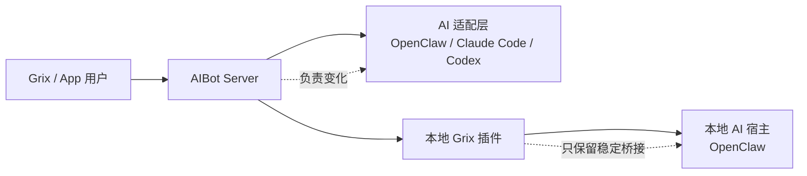

# Grix 插件 / Server 职责边界改造计划

> 更新时间：2026-04-08
> 状态：实施中（阶段 0–1 已完成，阶段 2 部分完成，阶段 3–4 已完成，阶段 5 未开始）
> 适用范围：`index.ts`、`src/channel.ts`、`src/group-adapter.ts`、`src/group-tool-policy.ts`、`src/monitor.ts`、`src/resume-context.ts`、`src/inbound-context.ts`、`src/outbound-envelope.ts`、`src/exec-approvals.ts`、`src/group-semantics.ts`、`src/admin/*`，以及 server 侧对应的调度、协议适配、版本匹配模块
> 关联文档：
> - 稳定合同：`backend/docs/plugin_backend_stable_contract.md`（backend 仓库）
> - 跨项目阶段对齐：`docs/05_cross_project_phase_alignment.md`

这份文档只回答一件事：

1. `grix` 插件和 server 端以后到底各自负责什么
2. 现有代码里哪些能力应该继续留在插件，哪些应该迁到 server
3. 后续改造按什么顺序做，做到什么程度才算边界清晰

---

## 0. 总体职责线（插件 / AIBot / App）

后续需要统一按这条主线落地，避免边界反复漂移：

1. `grix` 插件负责端侧与 OpenClaw 建连和稳定转发。
2. 插件只转发 OpenClaw 原生命令和 AIBot 侧已适配后的命令，不负责业务处理。
3. AIBot 是通用 AI Agent 调度器，不应因接入的是 OpenClaw / Claude / Codex 而改变核心调度边界。
4. app 负责交互与展示，不应把具体 agent 类型耦合进主业务流程。
5. app 若需要少量 agent 专属交互命令，应通过专门的轻量适配器承接，而不是污染通用交互模型。

这条职责线是后续所有拆分决策的最高优先级约束。

---

## 1. 改造目标

本次改造的核心目标不是“重写一遍”，而是把变化责任放到正确的位置：

1. `grix` 插件安装在客户机器上，应该尽量稳定，尽量少改
2. server 端部署在远端，应该承接 OpenClaw、Claude Code、Codex 等不同 AI 类型的适配变化
3. 新增 AI 类型、跟进 AI 版本、修改协议细节时，默认应该优先只改 server
4. 插件只保留本地必需、稳定、不可远程替代的能力

一句话目标：

`grix` 插件负责端侧连接与转发，不负责业务处理；AIBot 负责通用调度和差异吸收。

---

## 2. 为什么现在必须拆边界

当前仓库虽然模块拆分已经不差，但职责边界已经开始外扩，主要问题有：

1. 插件入口同时承接了 Channel、管理工具、CLI、Prompt Hook，不再只是一个轻量桥接层
2. 一部分群聊语义判断、审批命令识别、结构化卡片包装，已经在插件本地落地
3. `grix_query`、`grix_group`、`grix_agent_admin` 这类本质上偏远端管理的能力，也放进了客户机插件
4. 如果以后继续在插件内追 OpenClaw、Claude Code、Codex 的版本差异，客户机插件会越来越重，升级压力也会越来越大

这和部署现实是冲突的：

1. 客户经常升级本地 AI 运行环境
2. 插件安装在客户机，升级成本高、问题反馈慢、回滚麻烦
3. server 端更容易升级，也更适合维护版本矩阵、兼容策略和灰度逻辑

所以现在最需要解决的不是“功能够不够”，而是“变化到底应该落在哪一侧”。

---

## 3. 完成标准

这次边界改造做到下面这些，才算真正完成：

1. 新增一个 AI 类型，默认不需要改 `grix` 插件
2. 跟进某个 AI 的新版本，默认优先只改 server
3. 插件发版的触发条件，收敛到本地宿主接口变化、传输协议变化、安全修复这几类
4. 群聊分发策略、审批交互格式、卡片格式、远端管理接口，不再由插件主导演进
5. 插件测试重点变成“稳定协议是否正确”，server 测试重点变成“不同 AI / 版本是否适配正确”

如果做完之后，日常版本追踪还主要发生在插件仓库里，那就说明这次拆分没有成功。

---

## 4. 边界总原则

### 4.1 插件侧原则

插件侧只保留四类能力：

1. 本地宿主集成能力
2. 稳定消息传输能力
3. 最小上下文映射能力
4. 最小诊断和配置能力

插件不应该承载“经常会因为 AI 产品升级而变化的规则”，也不应该承载业务流程编排。

### 4.2 Server 侧原则

server 端负责所有高变化能力：

1. AI 类型差异
2. AI 版本差异
3. 协议差异
4. 行为策略差异
5. 卡片和审批等业务交互差异

凡是需要持续追踪 OpenClaw、Claude Code、Codex 发布变化的逻辑，都应该优先落在 server（AIBot）。

### 4.3 单一职责原则

后续代码拆分必须遵守：

1. 传输层只做传输，不夹带业务策略
2. 本地执行层只做本地动作执行，不解释复杂业务语义
3. server 适配层只做 AI 差异吸收，不直接污染插件传输层

---

## 5. 目标职责划分

### 5.1 `grix` 插件必须负责的能力

这些能力留在插件里是合理的，也是必要的：

1. 与 AIBot 的 WebSocket 建连、鉴权、保活、重连
2. 入站事件接收与基础回执
3. 出站消息发送、流式追加、撤回删除
4. `session_route_bind` / `session_route_resolve` 这类传输路由辅助
5. 把 AIBot 入站事件映射成 OpenClaw 能接收的最小上下文字段
6. 把 OpenClaw 的最小出站结果映射成 AIBot 可发送消息
7. 本地必需动作执行
8. 最小配置、健康检查、最小诊断输出

这里的关键词是“最小”：

1. 只保留稳定字段映射
2. 不在本地继续扩展业务规则
3. 不在本地承接 AI 产品差异
4. 不在本地做业务流程判断
5. 不在本地做 agent 类型分流

### 5.2 Server 必须负责的能力

这些能力以后应该明确归 server：

1. OpenClaw / Claude Code / Codex 的协议差异吸收
2. 不同版本的能力矩阵、兼容判断、降级策略
3. 群聊分发策略和目标判定策略
4. 审批交互语法、审批卡片格式、审批流程编排
5. 结构化卡片的业务含义和版本演进
6. 远端管理接口编排
7. 不同 AI 的工具暴露策略、能力开关、行为差异
8. 版本跟踪、灰度、回滚和兼容告警
9. app 通用领域模型与 agent 专属交互适配器之间的边界治理

### 5.3 插件明确不应该再负责的能力

后续要把这些列成红线，避免继续长回去：

1. 跟踪 OpenClaw / Claude Code / Codex 各自版本差异
2. 在插件内写每个 AI 类型的定制行为分支
3. 在插件内定义审批命令语法和业务交互规则
4. 在插件内持续扩展远端管理 API
5. 在插件内维护会频繁变化的业务卡片协议
6. 在插件内做“server 本该知道”的策略判断

---

## 6. 目标架构



目标状态下，这几层的职责应该是：

1. 用户只和 Grix / App 交互
2. server 负责理解“当前接的是哪种 AI、哪个版本、该怎么适配”
3. 插件只负责把消息和动作稳定送到本地宿主，再把结果稳定送回 server
4. 本地宿主继续按自己的正规方式运行，不靠插件取巧改源码

---

## 7. 现有能力拆分建议

下表给出当前仓库里的主要能力，后续应该往哪边收：

| 能力 | 当前落点 | 目标归属 | 改造方向 |
|---|---|---|---|
| WebSocket 建连、鉴权、保活、重连 | `src/client.ts` | 插件 | 保留 ✅ |
| AIBot 入站事件 -> OpenClaw 上下文映射 | `src/monitor.ts` | 插件 | 收敛为最小字段映射 |
| 出站 `send_msg` / `client_stream_chunk` / `delete_msg` | `src/channel.ts`、`src/aibot-payload-delivery.ts` | 插件 | 保留 ✅ |
| 路由绑定与解析 | `src/client.ts`、`src/target-resolver.ts` | 插件 | 保留 ✅ |
| 群聊每条消息的事实提示 | `src/group-semantics.ts` | Server 主导 | 已从“策略文案”收缩为事实提示 ✅（只保留 group turn / wasMentioned / mentionsOther / mention ids） |
| 群聊目标分发策略 | 文档约定 + 本地辅助逻辑 | Server | 明确完全归 server |
| 审批命令语法识别 | `src/exec-approvals.ts` | Server | 改为 server 下发标准本地动作 |
| 审批结果卡片和业务语义 | `src/exec-status-card.ts` 等 | Server | 插件只做标准载荷透传或最小渲染桥接 |
| 群聊通用提示和工具限制 | `src/group-adapter.ts`、`src/group-tool-policy.ts` | Server 主导，插件收缩 | 仍有一部分通用提示和 group tool policy 留在插件侧，阶段性保留 🔶 |
| 远端管理工具 | `src/admin/*` | Server | 已收口到 `grix_query` / `grix_group` + 本地 `doctor`，但仍属于 pending-migration 🔶 |
| Prompt 级行为提示 | `src/group-adapter.ts`、`src/inbound-context.ts`、`src/resume-context.ts` | Server 主导，插件最小化 | `inbound-context.ts` 已移除策略提示；但群聊 intro hint 与 resume hint 仍有本地行为建议 🔶 |
| 本地 `doctor` / 最小配置检查 | `src/admin/cli.ts` | 插件 | 保留最小诊断，不扩展成远端编排入口 |
| HTTP 查询类工具调用（联系人 / 会话 / 消息搜索） | `src/admin/query-service.ts` + `agent-api-http.ts` | 插件→WS | 改为通过现有 WS 连接发 `agent_invoke`，删除 HTTP 信道 ✅ |
| HTTP 群组管理工具调用 | `src/admin/group-service.ts` + `agent-api-http.ts` | 插件→WS | 同上，统一走 WS ✅ |
| Agent 创建管理 | `src/admin/agent-admin-service.ts` | Server 直接 API | 从插件移除，改为 backend admin 接口，不经插件 ✅（插件入口、实现与 CLI 旧入口均已移除） |
| HTTP Base URL 推导逻辑 | `src/admin/agent-api-http.ts` | 删除 | WS 信道统一后无需维护独立 HTTP 地址 ✅（已删除） |

---

## 8. 这份仓库的具体改造方向

### 8.1 保留并稳定的部分

这一层应尽量少改，后面测试也要重点保护：

1. `src/client.ts`
2. `src/channel.ts` 里的基础收发能力
3. `src/partial-stream-delivery.ts`
4. `src/protocol-send.ts`
5. `src/protocol-text.ts`
6. `src/target-resolver.ts`
7. `src/delete-target-resolver.ts`

这一层未来应被视为“传输核心层”。

### 8.2 需要收缩职责的部分

这些模块不一定立刻删除，但应该先停止继续长复杂度：

1. `src/group-semantics.ts`
2. `src/group-adapter.ts`
3. `src/channel-exec-approvals.ts`
4. `src/group-tool-policy.ts`
5. `src/inbound-context.ts`
6. `src/outbound-envelope.ts`

处理方向：

1. 尽量只保留事实提取
2. 去掉越来越像业务策略的判断
3. 去掉越来越像产品交互协议的拼装

### 8.3 应迁出插件主边界的部分

这些能力后续要逐步从”插件主职责”中拿出去：

1. `src/admin/*`（除 `cli.ts` 的最小诊断能力外）
2. `src/exec-approvals.ts`
3. 聊天审批命令解析（原 `src/exec-approval-command.ts`，已删除）
4. `src/exec-approval-card.ts`
5. `src/exec-status-card.ts`
6. `src/egg-install-status-card.ts`
7. `src/user-profile-card.ts`
8. `src/tool-execution-card.ts`
9. `src/admin/agent-api-http.ts`（HTTP 信道整体删除，已完成）
10. `src/admin/agent-api-actions.ts`（保留 `agent_invoke` 参数打包与校验，不再承担 HTTP / create 分支）

这里的原则是：

1. 远端业务管理能力，不应该继续绑定在客户机插件上
2. 高频变化的业务卡片协议，不应该由插件主导演进
3. 本地若还需要执行动作，只保留一个稳定的本地动作执行入口
4. 与 server 之间只维护一条 WS 信道，不再额外维护 HTTP 信道和 URL 推导逻辑

### 8.4 `index.ts` 的目标形态

`index.ts` 最终应回到更轻的注册职责：

1. 注册稳定 Channel
2. 注册最小必要 Hook
3. 注册最小诊断入口

而不是继续作为“所有远端管理能力的挂载点”。

---

## 9. 分阶段迁移计划

### 阶段 0：冻结边界并立规则 ✅ COMPLETE

先做定义，不急着改行为：

1. 明确一份稳定的插件对 server 合同，定义 `contract_version`
2. 把当前插件里的模块逐个标注”传输层 / 本地执行层 / 业务策略层 / 远端管理层”
3. 明确红线：后续新增 AI 适配逻辑，默认不允许直接写进插件

这一阶段的产出：

1. 边界文档 ✅
2. 模块归属清单 ✅（当前计划范围内的入口文件与 `src/admin/*` 已标注 `@layer`：core / business / pending-migration）
3. 迁移优先级清单 ✅

### 阶段 1：先拆代码层次，同步建立 WS 请求-响应基础 ✅ COMPLETE

这一阶段重点是“拆干净”，并为 HTTP → WS 迁移打好基础：

1. 在插件内部先把传输核心层和业务扩展层隔开 ✅
2. 给传输核心层补稳定合同测试 ✅
3. 给高变化模块打上弃扩标记，不再继续堆逻辑 ✅
4. 在 `src/client.ts` 基于现有 `request()` 方法封装 `agentInvoke()` 接口，发送 `agent_invoke` 并等待 `agent_invoke_result`（无需鉴权变更，复用已有 WS 会话） ✅（已实现，8 个测试通过）
5. backend 同步实现 `agent_invoke` 命令的路由和响应 ✅

已实现的关键交付：

- `agentInvoke()` 在 `src/client.ts` 中实现，复用 `request()` 基础设施 ✅
- `buildAgentInvokeParams()` 在 `src/admin/agent-api-actions.ts` 中实现，覆盖 13 个 action 的参数提取 ✅（7 个测试通过）
- `group-service.ts` 从 HTTP 迁移到 WS，使用 `agentInvoke` + `_client` 依赖注入 ✅（7 个测试通过）
- `query-service.ts` 从 HTTP 迁移到 WS，使用 `agentInvoke` + `_client` 依赖注入 ✅（6 个测试通过）
- 当前计划范围内的入口文件与 `src/admin/*` 已标注 `@layer` 分类（core / business-frozen / pending-migration） ✅

`agentInvoke` 的形态：

```typescript
// 复用 client.ts 现有 request() 基础设施
async agentInvoke(action: string, params: Record<string, unknown>, timeoutMs = 15_000) {
  return this.request("agent_invoke", {
    invoke_id: randomUUID(),
    action,
    params,
    timeout_ms: timeoutMs,
  }, { expected: ["agent_invoke_result"], timeoutMs });
}
```

WS 是会话级鉴权，`agent_invoke` 发送在已鉴权的 WS 连接上，**不需要重复鉴权**，也不需要单独管理 API key 或 HTTP base URL。

### 阶段 2：把高变化规则迁到 server，同步迁移 HTTP 信道 🔶 PARTIAL

优先迁这些：

1. AI 类型差异逻辑 ✅（B2 已完成：主链路通过 adapter 路由，不再有 OpenClaw 专属分支）
2. AI 版本适配逻辑 ✅（B2 已完成：adapter 运行时被使用，NormalizeOutbound/NormalizeApproval/NormalizeStatus 接入）
3. 审批语法和审批交互 ✅（聊天里的 `/approve` / `[[exec-approval-resolution|...]]` 已迁出插件主流程，backend 统一转 `local_action`，插件只执行 `exec_approve` / `exec_reject`）
4. 群聊策略判断 🔶（每条消息的 `GroupSystemPrompt` 已收缩为事实描述；但 `src/group-adapter.ts` 的通用群聊 intro hint 和 `src/group-tool-policy.ts` 的限制仍在插件侧）
5. 卡片协议演进 ⬜（等待 backend 统一 card domain model）
6. **`grix_query` 工具（contact_search / session_search / message_history / message_search）改用 `agent_invoke` 替代 HTTP** ✅（已在阶段 1 完成）
7. **`grix_group` 工具（9 个群组管理动作）改用 `agent_invoke` 替代 HTTP** ✅（已在阶段 1 完成）
8. **`src/admin/agent-api-http.ts`（HTTP 信道）删除** ✅（HTTP 通道与 URL 推导逻辑已移除）
9. **`local_action` / `local_action_result` 最小稳定子集** ✅（auth 已声明 `local_action_v1` + `local_actions=["exec_approve","exec_reject"]`，`monitor.ts` 已接入稳定 handler 和单测）

迁移后插件侧的形态：

1. 接收 server 下发的 `local_action`（审批、管理动作）
2. 在本地执行稳定动作，回传 `local_action_result`
3. 主动发起远端查询和操作，通过 `agent_invoke` / `agent_invoke_result`
4. 不再持有 HTTP 信道，不再维护 API base URL 推导逻辑

### 阶段 3：缩减插件公开能力面，移除 agent_api_create ✅ DONE

这一阶段要开始收口：

1. 逐步弱化 `src/admin/*` 这类远端管理型入口 ✅（`grix_agent_admin` 已不再注册到插件入口）
2. `agent_api_create`（创建 agent）从插件移除，改为 backend admin 接口直接提供，不经插件 ✅（插件入口、CLI 和残留实现已移除）
3. README 和安装文档里，强调 server 侧适配才是主路径 ✅（README 已改为要求先通过 backend admin 路径准备远端 agent）
4. 插件 CLI 只保留本地诊断，不继续扩充远端编排能力 ✅（`openclaw grix create-agent` 已移除，CLI 仅保留 `doctor`）
5. 删除旧 HTTP 通道与创建分支，保留 `agent_invoke` 参数打包 ✅（`src/admin/agent-api-http.ts` 已删除，`src/admin/agent-api-actions.ts` 仅保留 WS 参数校验）

### 阶段 4：建立 server 端版本矩阵 ✅ COMPLETE

server 端需要补上正式的适配治理能力：

1. AI family registry
2. version matrix
3. capability matrix
4. downgrade rules
5. compatibility alerts

做到这里之后，新增和跟进版本的主战场就不会再落在插件仓库。

### 阶段 5：清理遗留实现 ⬜ NOT STARTED

最后再做清理，避免一开始大爆改：

1. 删除插件里已经被 server 接管的业务逻辑
2. 收敛旧文档
3. 收敛测试边界
4. 把插件仓库的目标重新写成“稳定桥接层”

---

## 10. 插件侧优先级

跨项目的串并行依赖以 `docs/05_cross_project_phase_alignment.md` 为准；如果只看插件侧单边收口，建议按下面顺序推进：

1. 先冻结边界和合同
2. 先把 WS 请求-响应基础（`agent_invoke` / `local_action`）打稳
3. 再把工具与审批这类已经具备稳定协议的能力迁到 server
4. 再迁剩余群聊通用提示、工具限制和卡片协议
5. 最后清理遗留实现和旧文档

原因很简单：

1. 先稳住协议，再谈迁出
2. 先迁收益最大、边界最清楚的能力
3. 最后再删旧逻辑，风险最低

---

## 11. Server 侧需要补的能力

如果只是把插件里的东西删掉，但 server 侧没有补齐，边界改造会失败。

server 侧至少要补这几项：

1. AI 类型注册和分流机制
2. 版本探测和能力矩阵
3. 标准本地动作协议
4. 审批与卡片的统一业务协议
5. 对 OpenClaw、Claude Code、Codex 的适配测试
6. 版本升级后的回归验证流程

建议 server 端以后统一维护如下信息：

1. `ai_family`
2. `ai_version`
3. `plugin_contract_version`
4. `supported_capabilities`
5. `degraded_capabilities`
6. `rollout_policy`

这样版本治理才会收敛到 server，而不是散落在各个客户机插件里。

---

## 12. 插件与 Server 的稳定合同建议

后续建议明确一份版本化的稳定合同，至少包含这些信息：

1. 插件身份：`plugin_id`、`plugin_version`
2. 本地宿主身份：`host_type`、`host_version`
3. 合同版本：`contract_version`
4. 能力声明：`capabilities`
5. 标准本地动作：例如发送消息、停止回复、执行审批、本地诊断
6. 标准结果结构：成功、失败、降级、不可执行

关键原则：

1. server 根据这些字段决定怎么适配
2. 插件不根据 AI 产品版本做复杂分支
3. 发生不兼容时，优先 server 降级，不优先要求客户升级插件

---

## 13. 非目标

这次改造不应该顺手做这些事：

1. 不做一次性重写全部插件
2. 不为了“统一”而把本地必需能力也搬走
3. 不为了兼容老旧数据而在新设计里继续堆历史负担
4. 不通过改 OpenClaw 源码来规避接口问题
5. 不把 server 逻辑换个名字继续塞回插件

---

## 14. 验收清单

后续正式进入改造时，每个阶段都要按这份清单验收：

1. 新增 AI 适配需求时，是否默认先改 server
2. 插件代码是否只在本地宿主接口变化时才需要跟进
3. 插件测试是否主要覆盖稳定传输和最小本地动作
4. server 测试是否覆盖 AI 类型和版本矩阵
5. README、设计文档、实现代码三者是否一致
6. 是否还存在“server 本该知道，但插件却在本地判断”的逻辑

如果第 6 条还大量存在，就说明边界还没有真正收紧。

---

## 15. 一句话结论

这次改造的方向应该非常明确：

1. `grix` 插件收敛成稳定、本地、最小的桥接层
2. server 承担 OpenClaw、Claude Code、Codex 等 AI 的适配、升级跟踪和版本匹配
3. 后续新增复杂度，默认加在 server，不默认加在插件

只有这样，客户机插件才能真正稳定，server 端也才能真正成为变化吸收层。
