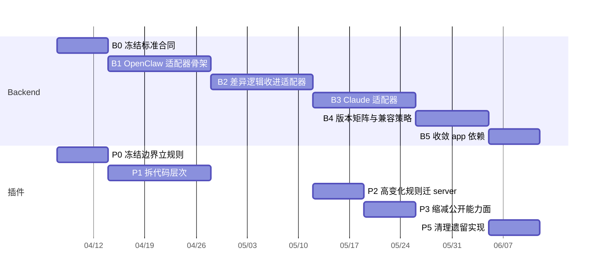

# 跨项目阶段对齐：插件边界改造 × Backend 适配器重构

> 更新时间：2026-04-08
> 状态：实施中（B0–B4 已完成；P0–P1 已完成，P2 部分完成，P3 已完成，P5 已解除阻塞但尚未清理）
> 关联文档：
> - 插件侧：`docs/04_grix_plugin_server_boundary_refactor_plan.md`
> - Backend 侧：`backend/docs/ai-agent-adapter-refactor-plan.md`  
> - 稳定合同：`backend/docs/plugin_backend_stable_contract.md`

两个计划各自有独立的分阶段推进路线，但两边存在明确的依赖关系。本文档只做一件事：

**明确两边哪些阶段必须串行、哪些可以并行、哪些有前置条件。**

---

## 1. 阶段对照总表

| backend 阶段 | backend 产出 | 插件阶段 | 插件产出 | 依赖关系 |
|---|---|---|---|---|
| B0：冻结标准合同 | `AgentClientMeta`、`NormalizedInboundEvent`、`DomainOutboundEvent`、`AdapterRegistry` 接口定义；稳定合同文档 | P0：冻结边界并立规则 | 边界文档、模块归属清单、迁移优先级清单 | **P0 和 B0 必须同步完成，互为前置** |
| B1：落 OpenClaw 适配器 | `OpenClawAdapterBase` 实现、适配器注册中心骨架 | P1：拆代码层次 | 传输核心层与业务扩展层隔开，稳定合同测试 | P1 可与 B1 并行；P1 产出是 B1 的配合条件 |
| B2：OpenClaw 差异逻辑收进适配器 ✅ | 主链路不再有 OpenClaw 专属分支；适配器运行时被使用（NormalizeOutbound/NormalizeApproval/NormalizeStatus） | P2：高变化规则迁到 server 🔶 | 审批语法已迁出；每条消息的群聊提示已收缩为事实描述；但 channel 级群聊 intro hint / tool policy 仍在插件侧 | **B2 已完成，P2 已开始但未收尾**；`agent_invoke` 已就绪，`local_action` 已开放最小稳定子集（`exec_approve` / `exec_reject`） |
| B3：接入 Claude 适配器 | `ClaudeAdapterBase` 按同一标准接入 | P3：缩减插件公开能力面 ✅ | `src/admin/*` 已收口到 `grix_query` / `grix_group` + 本地 `doctor`；README 与技能说明已更新 | P3 已完成；可与 B3 并行，互不阻塞 |
| B4：补版本矩阵与兼容策略 ✅ | `family registry`、`version range match`、`degrade policy`、`capability matrix` | — | — | B4 已完成；插件侧旧兼容路径清理已解除阻塞 |
| B5：收敛 app 侧依赖 🔶 | app 中 AI 家族专属判断清除；卡片线格式标准化（`claude_*`→`agent_*`）；翻译键/Widget Key 重命名；backend 适配器 `NormalizeInbound` 卡片类型归一化 | P4（如有）：建立 server 端版本矩阵 | 实际由 B4 承担 | B5 是 backend 收尾，插件侧无依赖 |
| — | — | P5：清理遗留实现 | 插件侧旧逻辑删除，测试边界收敛 | **P5 强依赖 B2 + B4 完成**；当前前置条件已满足，可以开始清理 |

---

## 2. 关键串行约束

以下约束是硬性的，违反会导致生产问题：

### 约束 1：合同先于迁移

**B0 + P0 必须在任何迁移动作之前完成。**

稳定合同（`backend/docs/plugin_backend_stable_contract.md`）是两边共同的锚点。没有合同就开始迁移，两边会各自理解边界，最终对不上。

### 约束 2：backend 接住才能插件迁出

**P2 的任何迁出动作，必须等 B2 对应能力上线之后才能执行。**

例如：
- 审批命令语法迁出 → 需要 backend 适配器里已有对应的 `local_action` 下发逻辑
- 群聊策略文案迁出 → 每条消息级别的策略文案已经收缩；剩余 channel 级 intro hint / tool policy 仍要等 backend 完整接住后再迁出
- 卡片协议迁出 → 需要 backend 已有统一卡片领域模型

迁出顺序建议（从最安全到风险最高）：

1. 群聊事实字段（只删每条消息策略文案，不删字段）— 已完成
2. 审批语法迁出 — 已完成，依赖 backend `local_action` 协议
3. channel 级群聊 intro hint / tool policy 迁出 — 仍待 backend 接住
4. 卡片协议迁出 — 需要 backend 统一卡片领域模型稳定
5. 远端管理接口迁出 — 需要 backend 对应 admin API 完整

### 约束 3：旧逻辑最后清理

**P5（删除插件侧旧逻辑）必须在 B2 + B4 之后。**

删早了，旧版本插件的用户会受影响。现在 B4 已完成，因此 P5 已解除阻塞，但仍应按真实活跃路径逐项清理。

---

## 3. 可并行推进的部分

以下工作两边可以独立并行，不互相阻塞：

| 插件侧 | Backend 侧 |
|---|---|
| P1：拆传输核心层与业务扩展层 | B1：落 OpenClaw 适配器骨架 |
| P1：补稳定合同测试 | B1：适配器注册中心骨架 |
| P3：弱化 `src/admin/*` | B3：接入 Claude 适配器 |
| P3：更新 README | B5：收敛 app 依赖 |

---

## 4. 联合验收检查点

在每个重要节点，两边应联合验收以下内容：

### 节点 1（B0 + P0 完成后）

- [ ] 稳定合同文档是否双边确认
- [ ] backend 接口定义（`AgentClientMeta`、`NormalizedInboundEvent` 等）是否已有 draft
- [ ] 插件模块归属清单是否完成
- [ ] 两边的红线规则是否一致（不再往插件加 AI 差异逻辑）

### 节点 2（B1 + P1 完成后）

- [ ] 插件传输核心层是否与业务扩展层已隔开
- [ ] OpenClaw 适配器骨架是否能接受插件发来的扩展 auth 字段
- [ ] 插件是否已开始上报 `contract_version` 和 `capabilities`

### 节点 3（B2 + P2 完成后）

- [ ] 主链路里是否已无 OpenClaw 专属分支
- [ ] 插件里审批命令语法是否已迁出
- [ ] 每条消息级别的群聊策略文案是否已收缩为事实描述
- [ ] channel 级群聊 intro hint / tool policy 是否也已迁出
- [ ] `local_action` / `local_action_result` 协议是否已在插件和 backend 两侧实现

### 节点 4（B4 + P5 完成后）

- [ ] backend 版本矩阵是否已能覆盖所有已知插件版本
- [ ] 插件侧旧逻辑是否安全删除（无活跃用户依赖）
- [ ] 新增 AI 版本时，默认改路径是否只在 backend 适配器

---

## 5. 里程碑时序图

注意：P2 的开始时间依赖 B2 完成，不是依赖 P1 完成。P1 可以比 B2 早结束，但 P2 不能先开始。

---

## 6. 风险提示

### 风险 1：P2 先于 B2 推进

症状：插件删掉了审批命令识别，但 backend 还没有 `local_action` 下发能力，导致审批功能中断。

预防：P2 每一项迁出都要与对应的 B2 子任务做联合验收，不能单边先上线。

### 风险 2：合同字段不一致

症状：插件上报的 `capabilities` 字段名和 backend 期望的不一致，导致适配器选择失败，走了错误的降级路径。

预防：`backend/docs/plugin_backend_stable_contract.md` 是唯一权威来源，两边实现前都必须对着这份文档写代码。

### 风险 3：旧插件大量在线时提前关闭旧路径

症状：还没先确认活跃插件版本分布，就开始关闭旧路径，导致旧版本插件断线。

预防：P5 清理之前，backend 必须从版本矩阵确认没有活跃的旧版本插件在线。
