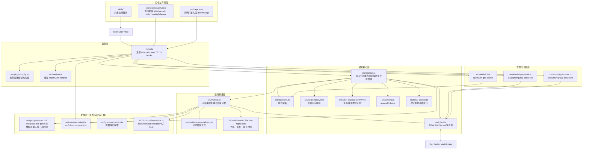
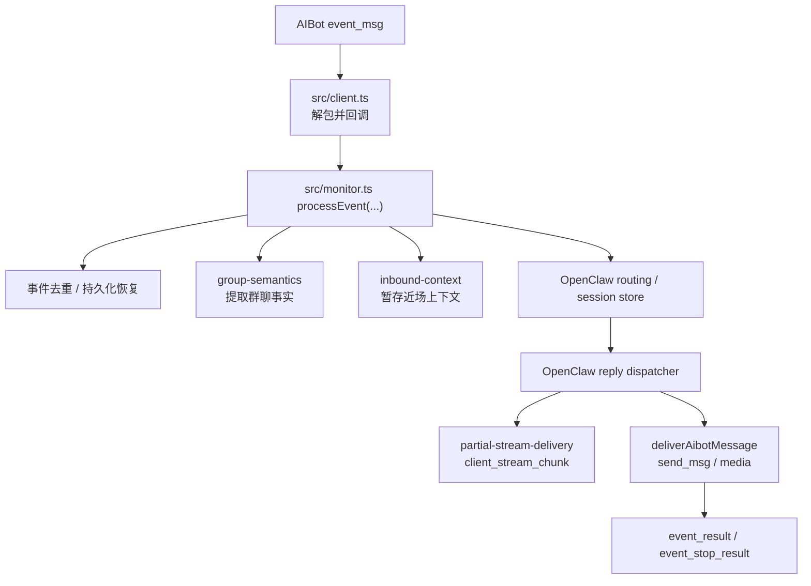
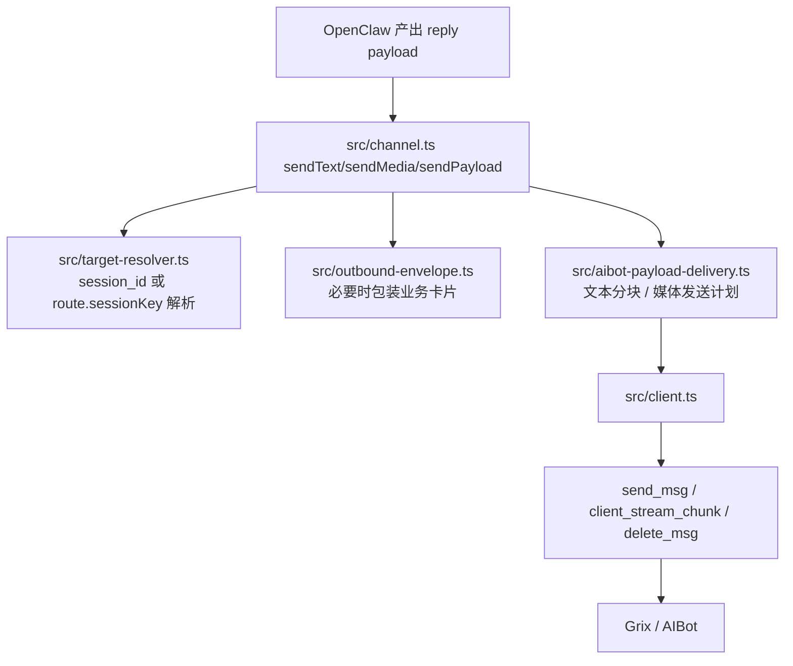
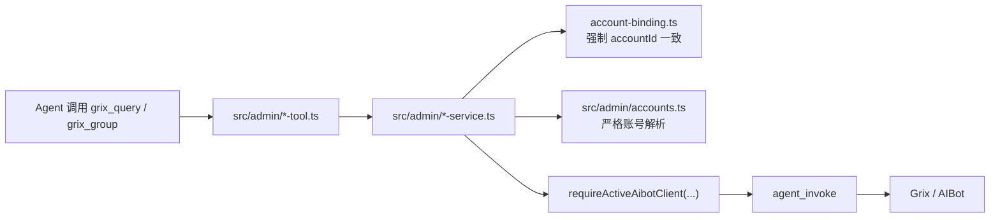

# Grix 插件架构图与模块拆解

> 更新时间：2026-04-08  
> 适用范围：`openclaw.plugin.json`、`index.ts`、`src/channel.ts`、`src/group-adapter.ts`、`src/group-tool-policy.ts`、`src/monitor.ts`、`src/client.ts`、`src/resume-context.ts`、`src/inbound-context.ts`、`src/local-actions.ts`、`src/admin/*`、`skills/*`

这篇文档只回答三件事：

1. 这个插件在 OpenClaw 里是怎么被装配起来的
2. 一条消息进入插件后，会经过哪些层再回到 OpenClaw 或发回 Grix
3. 仓库里的模块现在各自负责什么，哪些是稳定桥接层，哪些是待收缩的扩展层

---

## 1. 一句话总览

`grix` 插件本质上是一个“本地桥接器”：

1. 由 `index.ts` 负责装配入口
2. 由 `src/channel.ts` 对外声明成一个 OpenClaw Channel
3. 由 `src/monitor.ts` + `src/client.ts` 维持与 Grix/AIBot WebSocket 的长连
4. 由 `src/admin/*` 暴露两个远端管理工具和一个本地诊断命令
5. 由 `skills/` 提供安装后可被 OpenClaw 发现的内置技能

换句话说，这个仓库不是单一“聊天通道”，而是“通道 + 运行时桥接 + 工具入口 + 本地诊断 + 内置技能”的组合插件。

---

## 2. 顶层分层图

---

## 3. 装配关系

### 3.1 插件是怎样被 OpenClaw 发现的

| 层 | 文件 | 职责 |
|---|---|---|
| 插件清单 | `openclaw.plugin.json` | 声明插件 `id=grix`、`skills` 目录、`channels=["grix"]`、插件配置结构 |
| 包发布入口 | `package.json` | 把 `dist/index.js` 暴露给 OpenClaw 扩展加载器 |
| 真实入口 | `index.ts` | 在运行时注册 channel、tools、CLI、prompt hook |

### 3.2 `index.ts` 注册了什么

`index.ts` 是典型的“薄装配层”，只负责把下面几类能力挂到 OpenClaw：

1. `api.registerChannel({ plugin: aibotPlugin })`
2. `api.registerTool(...)` 注册 `grix_query`
3. `api.registerTool(...)` 注册 `grix_group`
4. `api.registerCli(...)` 注册 `openclaw grix doctor`
5. `api.on("before_prompt_build", ...)` 在提示词构建前注入恢复上下文和待注入群聊上下文

这意味着插件主入口没有承载具体业务逻辑，真正的逻辑分散在 channel、monitor、admin、hook 模块里。

---

## 4. 运行时主链路

### 4.1 启动链路

```mermaid
flowchart LR
    Start["OpenClaw 启动插件"] --> Entry["index.ts register()"]
    Entry --> Channel["src/channel.ts"]
    Channel --> Gateway["gateway.startAccount()"]
    Gateway --> Monitor["monitorAibotProvider()"]
    Monitor --> Client["new AibotWsClient(...)"]
    Client --> Auth["auth / heartbeat / reconnect"]
    Auth <--> Server["Grix / AIBot"]
```

这里有两个关键点：

1. `src/channel.ts` 不只描述能力，也负责网关账号生命周期
2. 真正的长连接维持、鉴权、保活、重连都下沉在 `src/client.ts`

### 4.2 入站消息链路

这条链路里，`src/monitor.ts` 是真正的运行时中枢，主要做六件事：

1. 校验入站事件最小字段
2. 做重复事件保护和可恢复落盘
3. 把 Grix 事件映射成 OpenClaw 可消费的 `ctxPayload`
4. 记录 `sessionKey <-> session_id` 路由关系
5. 调用 OpenClaw 的回复分发器
6. 把 OpenClaw 的回复再转回 AIBot 协议回包

### 4.3 出站回复链路

这一侧的职责拆分比较清楚：

1. `src/channel.ts` 负责对接 OpenClaw Channel 接口
2. `src/target-resolver.ts` 负责把 OpenClaw 给的目标解析成真实 `session_id`
3. `src/aibot-payload-delivery.ts` 负责决定文本、媒体、分块怎样发送
4. `src/client.ts` 只负责真正的协议发送与 ACK/NACK 收包

---

## 5. 工具、消息动作、本地命令如何复用同一条连接

### 5.1 远端管理工具

特点很明确：

1. 工具层不新建连接，只复用当前活跃的 WebSocket 客户端
2. 工具走的是 `agent_invoke`，不是单独的 HTTP 信道
3. `accountId` 被强制校验，避免跨账号误调用

### 5.2 消息动作

`src/actions.ts` 只暴露两个动作：

1. `unsend`
2. `delete`

两者最终都落到 `client.deleteMessage(...)`，只是 `unsend` 会额外走一套“静默清理计划”来找准目标消息和可能的命令消息。

### 5.3 本地诊断命令

`openclaw grix doctor` 走的是完全不同的一条线：

1. 由 `src/admin/cli.ts` 注册
2. 只读本地 OpenClaw 配置
3. 不访问 Grix/AIBot 远端接口

所以它属于“本地诊断面”，不是“聊天能力面”。

---

## 6. 模块职责表

| 层级 | 核心文件 | 主要职责 | 备注 |
|---|---|---|---|
| 声明层 | `openclaw.plugin.json`、`package.json` | 告诉 OpenClaw 如何发现和安装插件 | 静态入口 |
| 装配层 | `index.ts`、`src/plugin-config.ts`、`src/runtime.ts` | 注册能力、解析插件配置、缓存 runtime | 应保持轻薄 |
| 通道核心层 | `src/channel.ts`、`src/client.ts`、`src/accounts.ts`、`src/target-resolver.ts`、`src/local-actions.ts` | 账号解析、连接管理、出站路由、稳定本地动作 | 这是最稳定的桥接层 |
| 运行桥接层 | `src/monitor.ts`、`src/partial-stream-delivery.ts`、`inbound-event-*` | 入站事件落盘、去重、会话路由、回复分发、停止控制 | 运行时中枢 |
| 扩展层 | `src/group-adapter.ts`、`src/group-tool-policy.ts`、`src/group-semantics.ts`、`src/inbound-context.ts`、`src/outbound-envelope.ts`、卡片构造模块 | 群聊总提示、工具限制、群聊事实、额外上下文、结构化卡片包装 | 多数文件已标注冻结/待迁移 |
| 管理层 | `src/admin/*` | 工具调用、账号诊断、本地 doctor | 远端管理能力集中区 |
| 技能层 | `skills/*` | 安装后给 OpenClaw 暴露内置技能 | 插件能力的“文档化操作面” |

---

## 7. 当前架构的真实边界

从代码注释和模块分层看，这个仓库已经把边界表达得比较清楚：

### 7.1 稳定桥接层

这些模块更接近“插件真正长期要保留的核心”：

1. `index.ts`
2. `src/plugin-config.ts`
3. `src/channel.ts`
4. `src/client.ts`
5. `src/accounts.ts`
6. `src/target-resolver.ts`
7. `src/local-actions.ts`

共同特点：

1. 直接对接 OpenClaw 宿主接口或 AIBot 传输协议
2. 职责相对单一
3. 变化通常来自协议、连接、安全或宿主接口变化

### 7.2 运行期胶水层

`src/monitor.ts` 处在“核心桥接”和“业务扩展”之间：

1. 一方面它必须存在，因为入站事件总要有人接
2. 另一方面它现在承接了不少流程编排职责，所以是仓库里最重的中枢文件

可以把它理解为“当前架构的总调度室”。

### 7.3 待收缩扩展层

这些模块已经明显带有“业务适配”色彩：

1. `src/group-adapter.ts`
2. `src/group-tool-policy.ts`
3. `src/group-semantics.ts`
4. `src/inbound-context.ts`
5. `src/outbound-envelope.ts`
6. `src/exec-approval-card.ts`
7. `src/exec-status-card.ts`
8. `src/egg-install-status-card.ts`
9. `src/user-profile-card.ts`
10. `src/tool-execution-card.ts`
11. `src/admin/*` 里的远端管理工具能力

共同特点：

1. 更容易随着上游产品行为变化而变化
2. 不全是纯传输逻辑
3. 仓库内也已经用注释标成了 `FROZEN` 或 `pending-migration`

---

## 8. 这个架构的核心特点

### 8.1 优点

1. 入口装配薄，`index.ts` 比较克制
2. 传输核心和管理工具已经有明显分区
3. 工具、消息动作、聊天通道最终都能复用同一条活跃连接
4. 入站事件有去重、恢复、停止、流式发送这些运行期保护

### 8.2 当前复杂度主要集中点

1. `src/monitor.ts` 既处理协议事件，又处理运行编排，体量偏大
2. 卡片包装、群聊事实、提示词上下文仍在插件侧
3. `src/admin/*` 虽然已经收口，但仍然属于插件里的“远端管理面”

---

## 9. 读代码时可以按什么顺序看

如果要快速理解这个插件，推荐按下面顺序读：

1. `openclaw.plugin.json`
2. `index.ts`
3. `src/channel.ts`
4. `src/client.ts`
5. `src/monitor.ts`
6. `src/actions.ts`
7. `src/local-actions.ts`
8. `src/admin/query-tool.ts` 与 `src/admin/group-tool.ts`
9. `src/resume-context.ts`、`src/inbound-context.ts`、`src/outbound-envelope.ts`

按这条顺序看，最容易把“声明 -> 装配 -> 建连 -> 入站 -> 出站 -> 工具 -> 扩展”串成完整链路。
